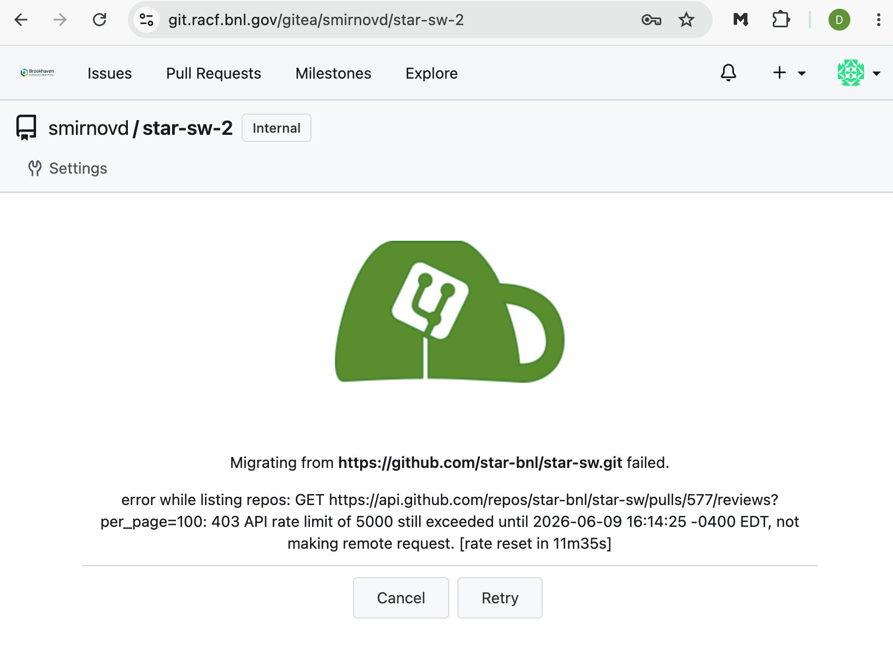
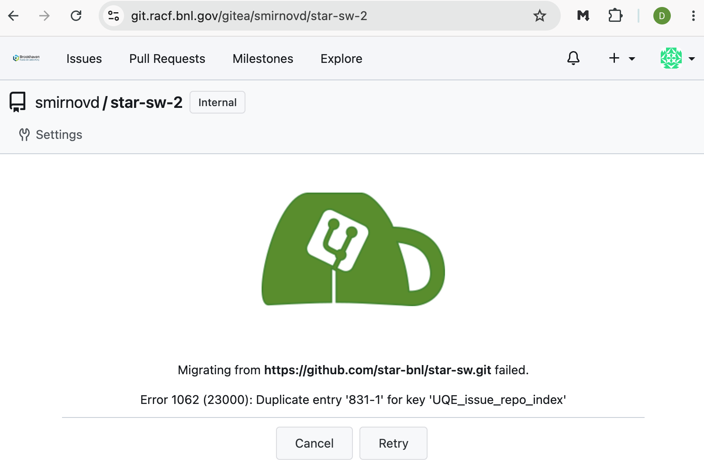

# Transitioning `star-sw` from GitHub to Gitea

This note summarizes the practical options for moving the `star-sw` repository
from GitHub to the STAR Gitea instance.

## Recommendation

Use a Git mirror push for the production cutover, and keep the GitHub issue and
pull request history as an external archive unless there is a strong requirement
to import that discussion history into Gitea.

This path cleanly transfers the repository history, branches, tags, and Git refs.
It does not transfer GitHub-native metadata such as issues, pull requests,
reviews, comments, labels, milestones, or assignees.

Gitea's built-in migration form can attempt to import GitHub issues and pull
requests when credentials are provided. In tests for this repository, however,
the full migration hit GitHub API rate limits, and retrying the partially
completed migration did not resume cleanly because duplicate entries were
reported. Treat the built-in full migration as something to validate on a clean
staging repository before using it for production.

## Observed Built-in Migration Errors

The built-in migration test first failed while listing GitHub pull request
reviews after the GitHub API rate limit was exhausted.



Retrying the partially completed migration did not resume cleanly and instead
reported a duplicate issue index entry.



## Migration Options

**Git mirror push** preserves commits, branches, tags, and Git refs. It does
not migrate issues, pull requests, reviews, or comments.

**Gitea built-in migration** attempts to migrate code plus issues and pull
requests. For large histories, it can be slow and is subject to GitHub API rate
limits.

**Gitea pull mirror from GitHub** keeps Git history synchronized from GitHub.
It makes GitHub the upstream source, so it is not the final state if Gitea is
primary.

**Custom archival import** can be tailored to the metadata that matters. It
requires scripting, testing, and a plan for identity and numbering differences.

## Code Migration

The code migration can be done with standard Git commands, provided the account
running the push has write access to the destination repository in the `STAR`
organization on Gitea.

Run this against an empty or disposable destination repository. `git push
--mirror` force-updates the destination refs to match the local mirror.

```shell
git clone --mirror git@github.com:star-bnl/star-sw.git star-sw-mirror.git
cd star-sw-mirror.git
git remote add gitea git@githost01.sdcc.bnl.gov:STAR/star-sw.git

# Do a final fetch immediately before the cutover push.
git fetch --prune origin
git push --mirror gitea
```

If the destination server rejects internal GitHub refs, push only branches and
tags:

```shell
git push gitea 'refs/heads/*:refs/heads/*'
git push gitea 'refs/tags/*:refs/tags/*'
```

## Cutover Checklist

1. Create the `STAR/star-sw` repository on Gitea, or confirm that the existing
   repository can be overwritten.
2. Configure Gitea repository access, branch protections, required reviewers,
   deploy keys, webhooks, and CI integration before the final push.
3. Pause writes to the GitHub repository during the final synchronization window.
4. Run the final mirror fetch and push.
5. Compare the visible branches and tags on both remotes:

   ```shell
   git ls-remote --heads git@github.com:star-bnl/star-sw.git | wc -l
   git ls-remote --heads git@githost01.sdcc.bnl.gov:STAR/star-sw.git | wc -l
   git ls-remote --tags git@github.com:star-bnl/star-sw.git | wc -l
   git ls-remote --tags git@githost01.sdcc.bnl.gov:STAR/star-sw.git | wc -l
   ```

6. Clone the Gitea repository into a fresh directory and run a basic build or
   repository sanity check.
7. Update documentation, developer instructions, CI settings, and any automation
   that still points to `github.com/star-bnl/star-sw`.
8. Restrict writes to the GitHub repository, or archive it, and add a pointer to
   the new primary Gitea repository.

## Issue and Pull Request History

There is no clean, low-risk path identified so far for moving all GitHub pull
requests, issues, reviews, and comments into Gitea while preserving the original
history and relationships.

The safest archival option is to leave the GitHub repository available in a
read-only or archived state and link to it from the Gitea repository. If the
discussion history must exist inside Gitea, do that as a separate archival
project:

1. Export GitHub issues, pull requests, review comments, labels, milestones, and
   users with a script that can be resumed safely.
2. Import into a staging Gitea repository first.
3. Decide how to represent GitHub users that do not have matching Gitea accounts.
4. Decide whether preserving GitHub issue and pull request numbers is required.
5. Verify comments, review state, labels, milestones, and cross-references before
   touching the production repository.

## Mirroring Notes

Gitea supports repository mirroring. A pull mirror from GitHub to Gitea is useful
for testing or for keeping a temporary Gitea copy up to date while GitHub remains
the source of truth. It is not the desired final arrangement if the goal is to
make Gitea the primary repository.

A push mirror from Gitea back to GitHub could be considered after cutover if a
secondary GitHub copy is needed, but it should be configured carefully because
push mirroring force-updates the remote repository.

## References

- [Gitea migration documentation](https://docs.gitea.com/usage/migration)
- [Gitea repository mirror documentation](https://docs.gitea.com/usage/repo-mirror)
- [GitHub REST API rate limits](https://docs.github.com/en/rest/using-the-rest-api/rate-limits-for-the-rest-api)
